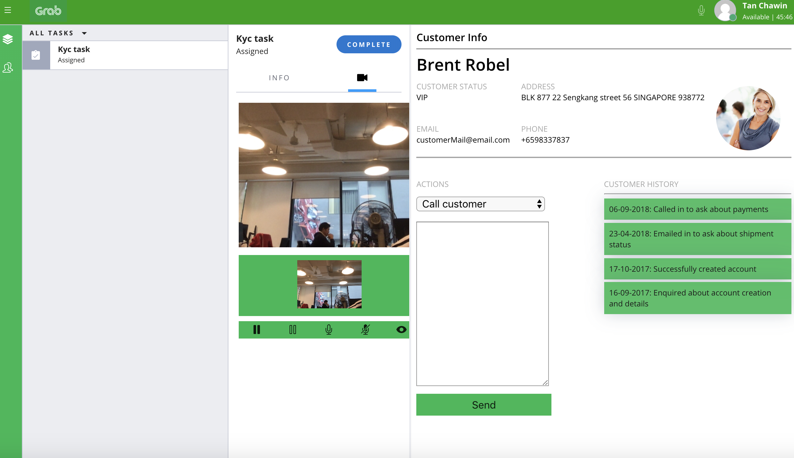
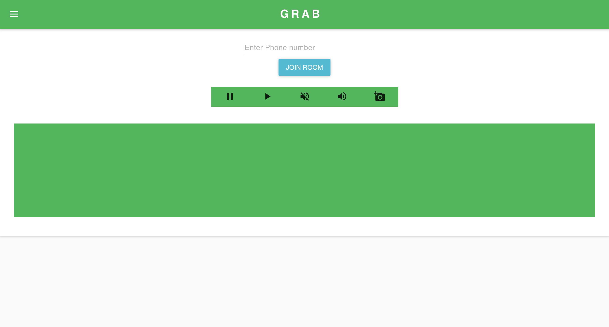

# Grab Video KYC Demo

This repository consist of the client (customer) user interface and the agent flex plugin.

## Agent flex view

Here's how the agent dashboard should look like when he accepts the task:



## Client View

This is the client view.



# Client side UI set up (customer view)
This project was bootstrapped with [Create React App](https://github.com/facebook/create-react-app).

## Credentials needed
1. Account sid
2. Auth token
3. Api Key
4. Api Secret

## Project specific set up

## Back End set up

There are 2 choices for your backend code. Either way, replace the credentials above with your own credentials.

### Choice 1 - Twilio functions
Copy the function from `Functions/client-token.js` and paste it in your twilio functions. 

Replace the empty credentials field with your twilio credentials.

Replace the url under `componentDidMount` with your twilio function url

### Choice 2 - From `index.js`
Replace the url with under `componentDidMount` with `http://localhost:8081`

Replace the empty credentials with your twilio credentials

cd into `video-client`

on your command line, run `node index.js`

## Front End set up

1. cd into `video-client/video-view`

run `npm start`

## Available Scripts

In the project directory, you can run:

### `npm start`

Runs the app in the development mode.<br>
Open [http://localhost:3000](http://localhost:3000) to view it in the browser.

The page will reload if you make edits.<br>
You will also see any lint errors in the console.

### `npm test`

Launches the test runner in the interactive watch mode.<br>
See the section about [running tests](https://facebook.github.io/create-react-app/docs/running-tests) for more information.

### `npm run build`

Builds the app for production to the `build` folder.<br>
It correctly bundles React in production mode and optimizes the build for the best performance.

The build is minified and the filenames include the hashes.<br>
Your app is ready to be deployed!

See the section about [deployment](https://facebook.github.io/create-react-app/docs/deployment) for more information.


# Flex Plugin Set up (Agent side)

This is a flex plugin for the agent side for the video kyc process. Once a customer clicks on a link to the client side, a task is programatically created for the agent.

## Credentials needed
1. Account sid
2. Auth token
3. Api Key
4. Api Secret
5. workspace sid
6. workflow sid
7. taskchannel sid

## Project specific set up

1. Copy paste the function in `src/Functions/TaskCreation.js` into your twilio function and give it an endpoint of `video_kyc`

2. Copy paste the function in `src/Functions/CrmBackend.js` into your twilio function and give it an endpoint of `crm_info`

3. Replace the credentials with your own twilio credentials.

4. Copy the url of your twilio function into the client code, under function `joinRoom` after the line `Video.connect`.

```
joinRoom() {
      /**
      *
      * Some other code
      *
      /**
     Video.connect(this.state.token, connectOptions).then(this.roomJoined, error => {
       alert('Could not connect to Twilio: ' + error.message);
     });

    // PUT YOUR URL HERE
     fetch(Your URL', {
       method: 'post',
       headers: {
        Accept: 'application/json',
        'Content-Type': 'application/json'
        },
        body: JSON.stringify({
          room: this.state.roomName
        })
     }).then(res => res.json())
     .then(json => console.log(json))
    }
```

## Setup

Make sure you have [Node.js](https://nodejs.org) as well as [`npm`](https://npmjs.com) installed.

Afterwards, install the dependencies by running `npm install`:

```bash
cd 

# If you use npm
npm install
```

## Development

In order to develop locally, you can use the Webpack Dev Server by running:

```bash
npm start
```

This will automatically start up the Webpack Dev Server and open the browser for you. Your app will run on `http://localhost:8080`. If you want to change that you can do this by setting the `PORT` environment variable:

```bash
PORT=3000 npm start
```

When you make changes to your code, the browser window will be automatically refreshed.

## Deploy

Once you are happy with your plugin, you have to bundle it in order to deploy it to Twilio Flex.

Run the following command to start the bundling:

```bash
npm run build
```

Afterwards, you'll find in your project a `build/` folder that contains a file with the name of your plugin project. For example, `plugin-example.js`. Take this file and upload it into the Assets part of your Twilio Runtime.

Note: Common packages like `React`, `ReactDOM`, `Redux` and `ReactRedux` are not bundled with the build because they are treated as external dependencies so the plugin will depend on Flex to provide them globally.
